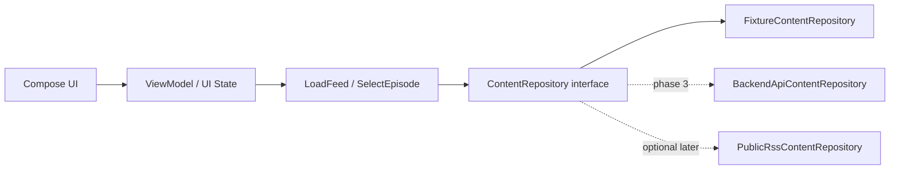

# Proposal: Android-старт automation-first

**Дата:** 2026-05-19  
**Статус:** финальный proposal после расследований process/product-state  
**Источник:** пункт 3 из `docs/specs/2026-05-19-project-state-android-and-agent-flow-investigation.md`

## Summary

Android нужно начинать как самостоятельный automation-first трек, а не как перенос iOS-ритуалов или попытку быстро догнать feature parity. Рекомендуемый старт: отдельный `android/` Gradle workspace, минимальный Compose slice с fixture/in-memory provider, JVM/unit feedback loop как первый обязательный gate, nullable `audio_url` в доменной модели с первого дня и emulator smoke позже, когда skeleton стабилен.

Текущий backend можно считать полезной целевой границей для read-only content API (`/v1/podcasts`, `/v1/feed`, episode lists, `audio_url == null` for premium teaser), но первый Android slice не должен зависеть от production backend, Railway, Transistor, Adapty secrets или локального Postgres. Paid access, account/subscription sharing, Instagram, voice comments, offline и hard CI/emulator policy откладываются как отдельные решения.

## Confirmed input facts

### Process / agent-flow facts

| Fact | Evidence | Android consequence |
|---|---|---|
| Жесткий iOS completion ritual `build -> install -> launch -> commit -> push` появился как iOS-specific правило, с сильным evidence явной просьбы Ильи. | `docs/specs/2026-05-19-process-guardrails-audit.md`, секции `Summary`, `Timeline`, `Inventory Guardrails`; source paths: `CLAUDE.md`, `docs/sessions/2026-04-25-16-podcasts-alphabetical-sort.md`. | Не переносить literal iPhone/Xcode/simctl ritual на Android. Сделать Android-specific verification loop. |
| Traceability через specs/session logs полезна, но обязательный log на каждую мелкую работу и глобальный "fresh session log" плохо масштабируются при параллельных треках. | `docs/specs/2026-05-19-process-guardrails-audit.md`, секции `Что оставить`, `Что пересмотреть`, `Последствия`. | Для Android читать релевантные track docs; писать session log для существенных решений, а не для каждого механического шага. |
| Auto `commit + push` не должен быть универсальным default для всех типов работ. | `docs/specs/2026-05-19-process-guardrails-audit.md`, секции `Что пересмотреть`, `Последствия`. | Android DoD может требовать verification evidence, но commit/push должны зависеть от explicit intent или выбранного PR-flow. |
| Fresh verification перед claim'ами остается важным guardrail. | `docs/specs/2026-05-19-process-guardrails-audit.md`, секции `Что оставить`, `Последствия`. | У каждого Android шага должна быть repeatable команда проверки; session log не заменяет test/build output. |
| `SECURITY.md` добавлен по прямой просьбе подумать о безопасности публичного repo; текущий файл смешивает public policy, stream rules, agent checks и product storage rules. | `docs/specs/2026-05-19-process-guardrails-audit.md`, секции `Подтвержденные факты`, `Inventory Guardrails`, `Что пересмотреть`; source paths: `SECURITY.md`, `.gitignore`, `docs/sessions/2026-04-25-02-corrections.md`. | Android наследует no-secrets boundary, но Android-specific details должны жить в Android docs/rules: keystore/google-services/signing files не коммитить, default tests без production secrets, provider secrets только backend/env. |

### Product / data facts

| Fact | Evidence | Android consequence |
|---|---|---|
| Backend сейчас предоставляет mounted read-only API для каталога/feed/episodes. | `docs/specs/2026-05-19-product-data-state-report.md`, секции `Backend API`, `Матрица состояния`; source paths: `api/src/app.ts`, `LiboLibo/Services/APIClient.swift`. | Backend API пригоден как будущая Android data boundary, но не обязан быть первым dependency. |
| Premium gating реализован через nullable `audio_url`: public episodes раскрывают URL, premium без entitlement получают `audio_url: null`. | `docs/specs/2026-05-19-product-data-state-report.md`, секции `Backend API`, `Data Flow`; source path: `api/src/lib/serialize.ts`. | Android domain model должен поддерживать `audioUrl: String?`; premium teaser можно строить без purchase flow. |
| Viewer entitlement сейчас определяется по `X-Adapty-Profile-Id`; backend cache keyed by `adapty_profile_id`. | `docs/specs/2026-05-19-product-data-state-report.md`, секции `Backend API`, `Payment/account model`; source paths: `api/src/middleware/viewer.ts`, `api/prisma/schema.prisma`, `api/src/routes/me.ts`. | Android paid access нельзя проектировать как простую копию iOS identity; subscription sharing unresolved. |
| Product login отсутствует; `User` в backend фактически связан с voice comments и Adapty profile id, а не с cross-platform account. | `docs/specs/2026-05-19-product-data-state-report.md`, секция `Payment/account model`; source path: `api/prisma/schema.prisma`. | Read-only/free Android MVP возможен без login; paid/share UX требует отдельного решения. |
| Instagram/admin/internal/media code exists but unmounted after rollback. | `docs/specs/2026-05-19-product-data-state-report.md`, секции `Backend API`, `Матрица состояния`, `Расхождения docs/code`; source path: `api/src/app.ts`. | Instagram не входит в Android MVP и не должен быть dependency. |
| Voice comments backend mounted, но iOS UI/recorder не найден; feature parity не подтвержден. | `docs/specs/2026-05-19-product-data-state-report.md`, секции `Backend API`, `Матрица состояния`, `Расхождения docs/code`; source path: `api/src/routes/comments.ts`. | Voice comments не входят в Android MVP. |
| Meaningful backend refresh/premium scenarios требуют Transistor/Adapty secrets или подготовленных fixtures; локальный backend не является бесплатным первым green loop. | `docs/specs/2026-05-19-product-data-state-report.md`, секции `Content/data flow`, `Матрица состояния`, `Последствия`; source paths: `api/src/transistor/refresh.ts`, `api/src/lib/adapty.ts`, `api/README.md`. | Первый Android slice должен работать на fixture/in-memory provider без production backend и secrets. |

## Final recommendation

### Repo layout

Выбрать standalone Android workspace в `android/`, по аналогии с автономным `api/` workspace:

```text
LiboLibo/
  LiboLibo/                 # existing iOS SwiftUI app
  LiboLibo.xcodeproj/
  api/                      # existing Express/Prisma backend workspace
  android/                  # new Android Gradle workspace
    settings.gradle.kts
    build.gradle.kts
    gradlew
    gradle/
    app/
      build.gradle.kts
      src/main/
      src/test/
      src/androidTest/
  docs/
```

Root-level Gradle workspace не рекомендуется: root уже несет iOS/backend/docs, и Android tooling не должен становиться неявной общей рамкой всего repo. Название `Android/` как peer к `LiboLibo/` тоже хуже: оно менее конвенционально для команд и автоматизации, чем `android/`.

### First vertical slice

Первый slice должен быть маленьким, но product-shaped:

1. Android project skeleton compiles.
2. Compose screen показывает fixture-backed feed или episode list.
3. UI state умеет выбрать episode или открыть минимальный detail state.
4. Доменная модель уже содержит `audioUrl: String?`.
5. Fixture содержит минимум один premium item с `audioUrl = null`.
6. JVM/unit test проверяет mapping fixture -> UI state и interaction state.
7. Slice не ходит в backend, RSS, Transistor, Adapty и не требует secrets.

Не начинать с "полного плеера", purchase flow, offline, comments, Instagram или production API call. Button-only "Hello World" допустим только как scaffold smoke на несколько минут, но первый содержательный slice должен сразу закрепить content boundary.

### Feedback loop commands

Canonical first gate:

```bash
cd android
./gradlew :app:testDebugUnitTest
```

Эта команда должна быть быстрой, deterministic, без emulator/network/secrets. Она проверяет domain/data mapping, ViewModel или reducer/state-holder, premium teaser state и базовую user interaction логику.

Ранний secondary smoke после стабилизации skeleton:

```bash
cd android
./gradlew :app:connectedDebugAndroidTest
```

`connectedDebugAndroidTest` полезен для launch/Compose smoke, но не должен быть единственным gate ранних задач. Если emulator недоступен, skip reason фиксируется явно; JVM/unit gate при этом остается обязательным.

### Data provider boundary

Минимальная архитектура должна отделить UI state от источника данных:



Recommended initial contract:

```kotlin
data class FeedEpisode(
    val id: String,
    val podcastTitle: String,
    val title: String,
    val isPremium: Boolean,
    val audioUrl: String?
)

interface ContentRepository {
    suspend fun loadFeed(): List<FeedEpisode>
}
```

Initial provider:

- `FixtureContentRepository` returns deterministic local data.
- At least one fixture item has `isPremium = true` and `audioUrl = null`.
- UI treats `audioUrl == null` as premium teaser, not as crash/error.
- No Adapty, login, restore or purchase button in first slice unless UX explicitly marks it non-functional and testable as teaser-only.

### Backend adapter timing

Add `BackendApiContentRepository` only after fixture-backed UI/domain state is green. Before making backend a hard dependency:

- capture representative anonymous `/v1/feed` fixture;
- capture or hand-author a premium teaser fixture with `audio_url: null`;
- define DTO -> domain mapping, including nullability and missing/empty states;
- define backend unavailable state;
- decide whether Android has only backend provider long-term or keeps RSS/public provider as optional fallback;
- add contract/fixture tests that run without live Railway.

Confirmed useful backend target for read-only Android:

- `GET /v1/podcasts`;
- `GET /v1/feed`;
- `GET /v1/podcasts/:id/episodes`;
- nullable `audio_url` for premium gating;
- optional `X-Adapty-Profile-Id` only after account/subscription policy is decided for Android.

Do not require for the first slice:

- live Railway production backend;
- local Docker/Postgres;
- Transistor refresh;
- Adapty Server API;
- comments audio volume;
- cron status;
- production secrets.

## Deferred decisions

| Decision | Deferred because | Earliest sensible trigger |
|---|---|---|
| Account/subscription sharing across iOS and Android | Current identity is iOS Adapty profile based; product account does not exist. | Before Android paid access, restore, or entitlement-aware playback. |
| Final paid UX | Purchase/restore/login moments depend on subscription sharing policy. | After account model decision. |
| Full feature parity with iOS | iOS has player/offline/local history/subscriptions without Android test architecture yet. | After feed/detail/player basics and Android verification loop are stable. |
| Instagram | Backend routes are unmounted after rollback. | Only if product explicitly revives Instagram track. |
| Voice comments | Backend exists, but client parity is not established and identity model matters. | After paid/account model and core playback are settled. |
| Offline downloads | Useful but expands storage, playback and entitlement edge cases. | After streaming/player behavior exists on Android. |
| CI/emulator policy as hard gate | Emulator availability can make first loop flaky. | After local JVM gate and first connected smoke exist. |
| Final backend contract beyond read-only content | Payment/account and future features may change auth/entitlement contract. | Before Android depends on entitlement-aware backend behavior. |

## Android Definition of Done / agent-flow checklist

For early Android work:

- Relevant context read: this proposal, `2026-05-19-process-guardrails-audit.md`, `2026-05-19-product-data-state-report.md`, and the latest relevant Android session/spec if one exists.
- Work stays inside the intended scope; first scaffold can touch `android/` and docs only if the task says so.
- `cd android && ./gradlew :app:testDebugUnitTest` passes, or the exact failure is reported with output summary.
- If Compose runtime/navigation/device behavior changed, run `cd android && ./gradlew :app:connectedDebugAndroidTest` or explicitly document why emulator smoke was skipped.
- No production secrets are needed for default tests.
- Any backend dependency has fixture/mock coverage.
- Premium teaser behavior handles `audioUrl == null`.
- No Android task inherits iOS-only `xcodebuild/simctl/iPhone 17` ritual.
- Commit/push happens only under explicit user intent or agreed PR workflow, not as universal automatic default.
- Session log/spec update is required for meaningful architecture, backend contract, process, account/payment or UX decisions; it is optional for tiny mechanical edits.
- Completion claims cite fresh verification commands, not assumptions.

## Phased implementation plan

### Phase 0: Scaffold and local test loop

Goal: create self-contained `android/` Gradle workspace and prove the agent can run a deterministic local check.

DoD:

- `android/` contains Gradle wrapper, settings and `app` module.
- Minimal app compiles.
- `./gradlew :app:testDebugUnitTest` is documented and passes.
- No backend, network, emulator or secrets are required.

### Phase 1: Fixture-backed feed slice

Goal: render a small content list through domain/data/UI boundaries.

DoD:

- `ContentRepository` interface exists.
- `FixtureContentRepository` supplies deterministic episodes.
- Domain model includes nullable `audioUrl`.
- UI state exposes normal playable item and premium teaser item.
- Unit tests cover fixture mapping and at least one selection/detail interaction.

### Phase 2: Compose/emulator smoke

Goal: add device-level confidence without making emulator the only feedback loop.

DoD:

- A connected/Compose smoke test launches the app and verifies first screen content.
- JVM/unit tests remain the mandatory first gate.
- Emulator requirement and skip policy are documented.

### Phase 3: Backend API adapter

Goal: connect Android to the current backend read-only content API behind the same repository boundary.

DoD:

- Captured fixtures or contract tests cover anonymous `/v1/feed`.
- DTO mapping handles `audio_url == null`.
- Backend unavailable, empty feed and malformed response states are explicit.
- Live backend is optional for local development and not required for unit tests.

### Phase 4: Playback/free listening

Goal: add minimal playback only for episodes with non-null `audioUrl`.

DoD:

- Play action is unavailable or teaser-only for `audioUrl == null`.
- Player state is testable without real network media in unit tests.
- Any device/media-session smoke is separate from the JVM gate.

### Phase 5: Paid/account decision

Goal: decide identity and subscription model before implementing Android paid access.

DoD:

- Chosen policy is documented: product account, provider-level linking, platform-specific subscriptions, or hybrid.
- Backend/API changes are scoped separately.
- Android purchase/restore UX is not implemented against unresolved identity assumptions.

## Consequences

- **Android:** start with a narrow but non-throwaway architecture: Compose UI, state holder/use case, `ContentRepository`, fixture provider, later backend adapter.
- **Tests:** JVM/unit tests are the first-class gate from day one; emulator tests are added early as smoke, not as the only source of confidence.
- **Local dev:** default Android development works without production backend, Railway, Postgres, Transistor, Adapty or secrets.
- **Backend:** read-only content API is a good target boundary, but Android should bind to it through DTO mapping and fixtures after the first local slice.
- **Payment/account:** Android can do free/read-only and premium teaser UI now; paid access waits for explicit cross-platform entitlement policy.
- **Future rules:** Android gets its own verification ritual and traceability rules; it should keep fresh evidence and docs, but not inherit iOS-specific commands or universal auto-push.
