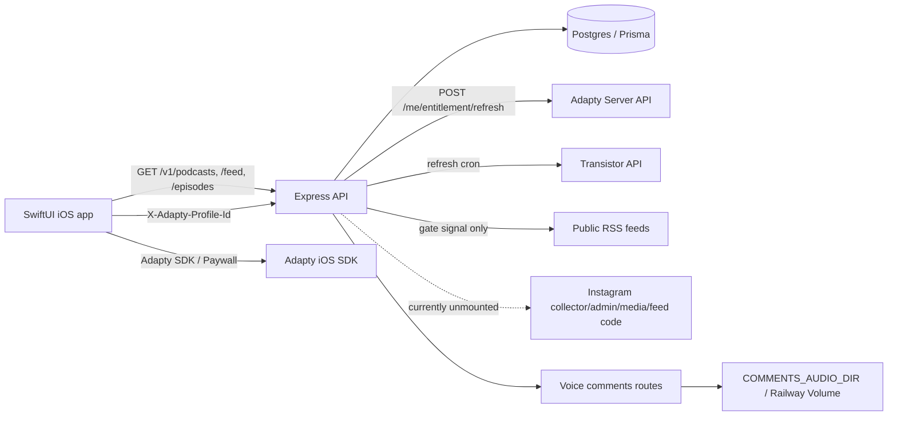
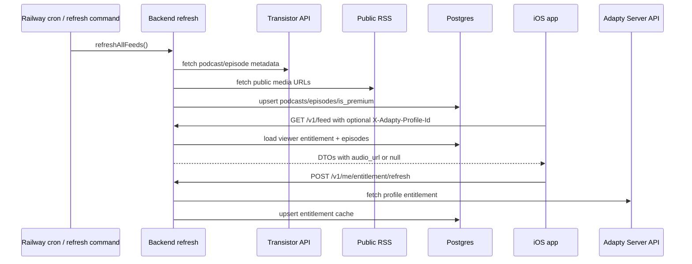

# Report: фактическое состояние продукта и данных

**Дата:** 2026-05-19  
**Статус:** артефакт расследования  
**Источник:** пункт 2 из `docs/specs/2026-05-19-project-state-android-and-agent-flow-investigation.md`

## Summary

Фактически сейчас есть iOS-приложение-плеер с табами `Фид / Подкасты / Моё / Search`, backend на Express/Prisma/Postgres, контентный refresh через Transistor API, premium-gating через backend entitlement cache по `X-Adapty-Profile-Id`, и backend-часть voice comments.

Для Android-старта главное: текущий контракт уже пригоден для чтения каталога, фида, эпизодов и premium-teaser UI, но payment/account model остается iOS-only. Идентичность завязана на Adapty profile id от iOS SDK, без продуктового аккаунта и без решенного cross-platform entitlement.

## Current Architecture

## Подтвержденные факты

### iOS

- Composition root создает `PodcastsRepository`, `SubscriptionsService`, `HistoryService`, `DownloadService`, `PlayerService`, `AdaptyService`; ставит `X-Adapty-Profile-Id` provider; на cold start активирует Adapty и refresh entitlement: `LiboLibo/App/LiboLiboApp.swift:5`, `LiboLibo/App/LiboLiboApp.swift:26`.
- Основные табы: feed, podcasts, profile, search; mini-player показывается только если есть `currentEpisode`: `LiboLibo/App/RootView.swift:3`, `LiboLibo/App/RootView.swift:55`.
- API-клиент по умолчанию ходит в Railway prod `https://libolibo-production.up.railway.app/v1`, а не в local: `LiboLibo/Services/APIClient.swift:13`.
- iOS-клиент знает `/podcasts`, `/feed`, `/podcasts/:id/episodes`, `/me/entitlement*`; comments API в Swift не найден: `LiboLibo/Services/APIClient.swift:39`.
- `Episode.audioUrl == nil` означает premium без entitlement; `isPlayable` зависит только от `audioUrl`: `LiboLibo/Models/Episode.swift:12`.
- Player использует `AVPlayer`, remote commands, speed, sleep timer, queue; premium без `audioUrl` не проигрывается: `LiboLibo/Services/PlayerService.swift:84`.
- Offline download есть локально через `Documents/Downloads` и `UserDefaults` metadata; premium без `audioUrl` не скачивается: `LiboLibo/Services/DownloadService.swift:4`, `LiboLibo/Services/DownloadService.swift:69`.
- Подписки на подкасты и история слушаний локальные, не backend-account: `LiboLibo/Services/SubscriptionsService.swift:4`, `LiboLibo/Services/HistoryService.swift:4`.
- Adapty SDK подключен; `ADAPTY_PUBLIC_SDK_KEY` сейчас прописан в `LiboLibo.xcodeproj/project.pbxproj:143`, хотя session log `docs/sessions/2026-04-25-27-adapty-sdk-wired.md:11` говорил, что ключ пустой и должен задаваться вручную.

### Backend API

- Mounted public API: `/v1/health`, `/v1/podcasts`, `/v1/feed`, `/v1/episodes`, `/v1/devices`, `/v1/me`, `/v1/comments`; legal pages root-level `/terms`, `/privacy`, `/support`: `api/src/app.ts:33`, `api/src/routes/legal.ts:228`.
- Instagram/admin/internal/media files существуют, но явно unmounted после rollback to unblock prod: `api/src/app.ts:11`, commit `220ab5f`.
- `audio_url` gating находится в `episodeToDTO`: public episodes всегда раскрывают URL; premium раскрывает URL только если `viewer.hasPremiumEntitlement`: `api/src/lib/serialize.ts:54`, `api/src/lib/serialize.ts:66`.
- `resolveViewer` читает `X-Adapty-Profile-Id`, ищет `entitlements`, проверяет expiry и не зовет Adapty: `api/src/middleware/viewer.ts:22`.
- Entitlement refresh зовет Adapty Server API и upsert'ит `entitlements`; без `ADAPTY_SECRET_KEY` возвращает `503`: `api/src/routes/me.ts:26`, `api/src/lib/adapty.ts:59`.
- Voice comments backend mounted and implemented: list public, post premium-only, delete by author profile id, audio stream public: `api/src/routes/comments.ts:73`, `api/src/routes/comments.ts:101`, `api/src/routes/comments.ts:198`.
- Prisma содержит `Device`, `Entitlement`, `User`, `Comment`, Instagram tables, но migration files не найдены; schema sync идет через `db push`: `api/prisma/schema.prisma:71`, `api/prisma/schema.prisma:148`, `api/README.md:32`.

### Content/data flow

- Refresh требует Transistor API. Code aborts if `TRANSISTOR_API_KEY` missing: `api/src/transistor/refresh.ts:37`.
- Transistor API дает metadata и private/published episodes; public RSS используется только как gate signal для exclusive episodes: `api/src/transistor/refresh.ts:5`, `api/src/transistor/public-rss.ts:3`.
- `is_premium = mediaUrl not in public RSS OR type == bonus`: `api/src/transistor/refresh.ts:164`.
- Seed loads 44 podcasts from `docs/specs/podcasts-feeds.json`: `api/src/lib/seed.ts:1`.

## Data Flow

## Матрица состояния

| Область | Заявлено в документах | Факт в коде | Тесты | Local/prod статус | Риск для Android |
|---|---|---|---|---|---|
| iOS core app | Native app, SwiftUI, AVFoundation | Есть табы, feed/catalog/profile/search, player, mini/full player | iOS tests не найдены | Xcode project; API default prod | Android нельзя копировать без тестового контура |
| Backend content API | OpenAPI `/health`, `/podcasts`, `/feed`, `/episodes` | Смонтировано и в целом совпадает | Partial tests around serialization/cursors | Docker/Railway | Хорошая стартовая граница для Android read-only |
| Premium gating | `audio_url: null` без entitlement | Реализовано в serializer + viewer middleware | `serialize.test`, `adapty.test`, `requirePremium.test` | Refresh требует `ADAPTY_SECRET_KEY` | Нужна Android identity before paid access |
| Adapty iOS | SDK + paywall | SDK/AdaptyUI импортированы, paywall wrapper есть | iOS tests не найдены | Public key в project; StoreKit config есть | iOS-specific purchase flow, не cross-platform |
| Offline | Локальные загрузки | Есть download/delete/local playback | iOS tests не найдены | Только device-local | Android может сделать отдельно, backend не хранит downloads |
| Voice comments | Spec говорит "plan"; session говорит backend done | Backend mounted; iOS UI/recorder не найден | Unit tests for storage/mime/requirePremium | Prod volume/smoke требует отдельной проверки | Android не должен считать feature доступной в UX parity |
| Instagram feed | Spec описывает full flow + iOS feed | Backend code exists, routes unmounted, iOS feed не найден | Instagram unit tests есть | Rollback commit отключил prod | Не брать в Android MVP |
| Admin/internal/media | Spec описывает `/admin`, `/internal`, `/media` | Code exists, not mounted | Partial tests for Instagram libs | Prod disabled | Не планировать dependency |
| Local dev | README: Docker works without secrets, public-only | API starts, но refresh без Transistor aborts; seed works | `npm test` available | No DB migrations, `db push` | Android local mock/API fixtures нужны |
| Deploy | Railway web + cron-refresh | README documents two services; app comments say no HTTP cron endpoint | Prod не проверялся | Expected Railway Postgres + cron | Need prod contract smoke before Android binding |

## Payment/account model

### Факты

- Продуктового логина нет; `step-2.3` прямо говорит "без логина", идентификатор зрителя - `adapty_profile_id`: `docs/specs/step-2.3-premium-adapty.md:1`, `docs/specs/step-2.3-premium-adapty.md:8`.
- Backend entitlement cache keyed by `adapty_profile_id`, not user account: `api/prisma/schema.prisma:151`.
- `User` exists only for voice comments and also keyed by `adapty_profile_id`: `api/prisma/schema.prisma:162`.
- `Device` exists for APNs/last seen, not auth or subscription ownership: `api/src/routes/devices.ts:14`.
- iOS restore UX explicitly says "На этом Apple ID нет активных подписок": `LiboLibo/Features/Profile/ProfileView.swift:143`.

### Интерпретация и риски

- Текущая модель достаточна для iOS-only: Apple/App Store + Adapty profile + backend cache.
- Для Android она не отвечает на вопрос "тот же человек купил на iOS и хочет слушать на Android". Android не сможет естественно предъявить iOS Adapty profile id без product account или explicit linking.
- Возможные будущие варианты: отдельный аккаунт продукта; provider-level identity/linking в Adapty; platform-specific subscriptions без sharing; hybrid model.
- До Android subscriptions нужно выбрать policy: бесплатный контент без login, момент login prompt, шаринг подписки между iOS/Android, миграция existing `adapty_profile_id`.

## Расхождения docs/code

- `README.md:18` говорит источник контента "RSS-фиды" как planned stack, но фактический backend refresh API-first Transistor; RSS только gate-signal: `api/src/transistor/refresh.ts:5`.
- `api/README.md:19` говорит, что без `transistor.env` API будет видеть только публичные эпизоды, но `refreshAllFeeds` aborts без `TRANSISTOR_API_KEY`: `api/src/transistor/refresh.ts:47`.
- Instagram spec/README описывают cron/admin/public feed как рабочий flow, но `api/src/app.ts:11` unmounts Instagram/admin/internal/media and says prod disabled.
- `docs/specs/step-04-voice-comments.md:3` все еще говорит "план, реализация в следующих сессиях", но backend code is mounted; iOS side still not implemented.
- Adapty session log says `ADAPTY_PUBLIC_SDK_KEY` empty, current project has a public live key in `project.pbxproj`.
- OpenAPI includes comments endpoints, but iOS `APIClient` does not expose comments methods.

## Последствия

- **Android:** стартовать с узкой data boundary: podcasts/feed/episode detail with nullable `audio_url`. `audio_url == null` трактовать как premium teaser.
- **Feature scope:** не стартовать с Instagram или voice comments UI parity. Instagram отключен, comments backend-only.
- **Local dev:** использовать mock provider/fixtures с первого дня. Текущий backend может стартовать без production secrets, но meaningful episode refresh/premium требует Transistor/Adapty secrets или preloaded fixtures.
- **Payment/account:** решить до Android paid access. Без product account или explicit provider linking Android subscriptions будут platform-specific или не смогут шарить iOS entitlement.
- **Tests:** добавить contract tests или captured fixtures для `/v1/feed` anonymous, premium entitlement, `audio_url` null/non-null, entitlement refresh error states.
- **Prod:** нужен отдельный smoke check Railway current DB/schema, `ADAPTY_SECRET_KEY`, `TRANSISTOR_API_KEY`, `COMMENTS_AUDIO_DIR` volume, cron-refresh status. Этот report prod не трогал и secrets не использовал.
